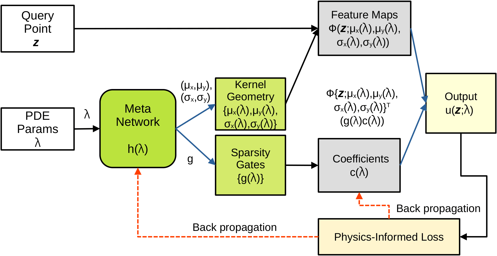

# Meta-Learned Basis Adaptation for Parametric Linear PDEs

Official implementation for the paper:

**Meta-Learned Basis Adaptation for Parametric Linear PDEs**


## Overview

Parametric families of linear partial differential equations arise in many scientific and engineering settings, where the solution varies continuously with physical parameters such as source location, transport speed, or diffusion strength. Standard physics-informed neural networks are usually trained separately for each new PDE instance, while operator-learning methods often rely on higher-dimensional latent representations that can be difficult to interpret.

This repository implements **KAPI**, a **kernel-adaptive physics-informed meta-learning framework** for solving such parametric PDE families with a **shared shallow solver**. Instead of predicting a solution field directly with a deep network, KAPI uses a lightweight meta-network to generate **task-adaptive kernel geometry**. The final solution is then assembled as a linear combination of localized kernels.

The main focus of this work is:

- **amortized solving across parameter space**
- **simple and shallow architecture**
- **explicit and interpretable kernel geometry**
- **physics-informed training without labeled solution data**

In particular, KAPI makes it possible to inspect:

- where kernels are placed,
- how wide they are,
- which kernels remain active,
- and how this geometry changes with PDE parameters.

## Main idea

For a parameter vector `λ`, a lightweight meta-network generates some subset of:

- kernel centers,
- kernel widths,
- sparsity gates,
- amplitudes or coefficients.

These quantities define a shallow localized basis, and the solution is synthesized through a linear kernel expansion. This keeps the representation compact and makes its behavior directly visualizable.

Compared with related paradigms:

- **vs. standard PINNs:** KAPI avoids retraining a new network for each task.
- **vs. PIELM:** KAPI does not keep the hidden basis fixed; instead it adapts kernel geometry across tasks.
- **vs. operator-learning networks:** KAPI is not learning a general map between function spaces; it is a **finite-dimensional parametric meta-solver** with explicit basis adaptation.

## PDE families included

This repository contains experiments for four representative parametric linear PDE families:

1. **2D Poisson equation** with Gaussian source  
   Parameters: source location and width

2. **1D periodic linear advection** with Gaussian initial condition  
   Parameters: pulse center and width

3. **1D advection-diffusion**  
   Parameters: advection speed and diffusion strength

4. **Variable-speed advection** with predictor-corrector refinement  
   Parameters: pulse center, width, and variable-speed strength

These cases are chosen to study steady elliptic behavior, pure transport, mixed transport-diffusion, and more challenging nonlinear characteristic transport.


## Citation

If you find this repository useful, please cite:

```bibtex
@inproceedings{
dwivedi2026kerneladaptive,
title={Kernel-Adaptive Physics-Informed Meta-Learning for Parametric Linear {PDE}s},
author={Vikas Dwivedi and Monica Sigovan and Sixou Bruno},
booktitle={AI{\&}PDE: ICLR 2026 Workshop on AI and Partial Differential Equations},
year={2026},
url={https://openreview.net/forum?id=YyTEEVEVid}
}
